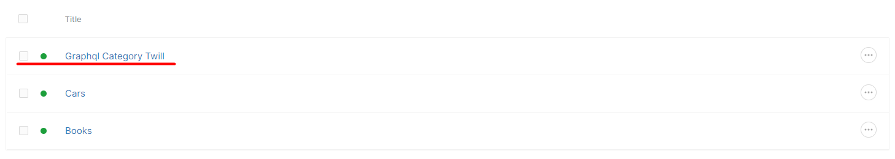

[:back: Back to parent](https://github.com/kallefrombosnia/twill-graphql/tree/master/docs/mutations)


### Module create mutation


Simple model creation with GraphQL looks like this:

Firstly define the corresponding schema for mutation.
```graphql
type Category{
    id: ID!
    published: Int!
    title: String
    description: String
}

type Mutation {
    createCategory(
        title: String!
        published: Int!
        description: String
    ): Category @create
}
```

In schema we firstly define Category model which required fields `id` and `published`, optional are `title` and `description`.

In create mutation for validation we could pass another directive `@rules` which will validation our input fields.

Example schema with the validation:

```graphql
type Mutation {
  createCategory(
    title: String! @rules(apply: ["string", "min:3", "max:64"])
    published: Int! 
    description: String @rules(apply: ["string", "min:20", "max:255"])
  ): Category @create
}
```

Lets define our mutation.

```graphql
mutation {
  createCategory(
    title:"Graphql Category Twill"
    published:1
    description: "GrapqhQL category."
  ) {
    id
    title
    published
    description
  }
}
```

Returned data:

```json
{
  "data": {
    "createCategory": {
      "id": "4",
      "title": "Graphql Category Twill",
      "published": 1,
      "description": "GrapqhQL category."
    }
  }
}
```

This confirms that query is successfull.




